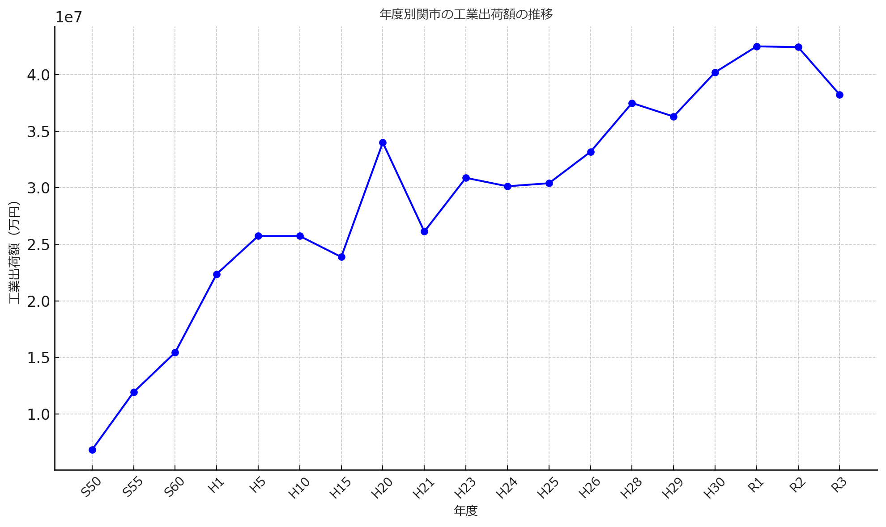

# 関市の数字と関市の概要

## 関市の数字

### 令和6年9月議会
- わかくさ・プラザ総合福祉会館の軽スポーツ室の利用者数
    - 改修以降、これまで軽スポーツ室で自由に卓球ができていた人達が使えなくなくなるという問題
    - 軽スポーツ室の利用者数
        - R2:5604人
        - R3:6702人
        - R4:6923人

- 10月からのコロナワクチン自己負担額
    - 関市は2000円

- 不登校支援について
    - 今年度から出張学び教室を実施
    - これまで４回実施した

- 子どもの虐待
    - R5相談件数 142件（内新規67人）

- 高齢者の虐待
    - 在宅での虐待
        - R3:8件
        - R4:4件
        - R5:5件

- 高齢者施設での虐待
    - R3:0件
    - R4:1件
    - R5:1件

- 0歳～5歳の人数
    - H26.4月　4687人
    - R6.4月　2978人
    - 1700人減少している

- 公共施設再配置計画の削減率について
    - 公共施設の面積を2063年までに35%削減する目標
    - 令和5年までで6.3%削減

- 特定小型原動機付自転車の登録
    - 関市の登録は13台。そのうちキックボードは11台

- 免許自主返納の人数
    - R3:255人
    - R4:250人
    - R5:234人

- マイナンバーカードの交付
    - 83.06%（全国は81%、岐阜県は84%）

- 市役所職員の採用
    - １次受験者
        - 大卒38人
        - 高卒短大卒8人
        - 保健師10人
    - 合格者
        - 大卒9人
        - 高卒短大卒　4人
        - 保健師5人

- 部活の地域クラブ移行数
    - 21クラブの登録
    - 12種目
        - 陸上
        - ラグビー
        - サッカー
        - 剣道
        - 卓球
        - バレー
        - バスケ
        - 野球
        - ソフト
        - ソフトテニス
        - 公式テニス
        - 吹奏楽

- 放課後デイ
    - 利用者　
        - R3.8月　216人
        - R6.8月　321人
    - 障がい者手帳を持たずに医師の診断による利用が66%
    - 事業所
        - R3.8月　19事業所
        - R6.8月　21事業所

- 農振除外申請
    - R4:18ヶ所
    - R5:23ヶ所
    - R6:23ヶ所

    - R4が決定できていなく、その後の64件全てがまだ申請許可が降りていない状態

- 訪問介護事業所の数　18事業所

- 南海トラフ地震の関市の被害予測
    - 関市では震度６弱
    - 建物の予測
        - 全壊　1502棟　
        - 半壊　4612等
    - 人的被害 午前5時に発生した場合
        - 死亡20人
        - 負傷者　623人
        - 重傷者　36人
        - 避難者　5643人
        - 帰宅困難者数　567人

    - 電力
        - 被災直後　83%が停電により支障
        - 被災1日後　24%
        - 被災4日後　全て復旧

    - 上水道
        - 被災直後　77%　が断水
        - 被災１週間後　31%
        - 被災１ヶ月後　4%

- 関市の事業所数
    - H26　5346社
    - H28　5046社
    - R3　4759社

- 災害時の企業との協定
    - ２７事業所が登録
- 重機保有台数
    - 建設業災害対策協議会と協定を結び、その事業者が保有する重機の数
        - R5年
            - 加盟事業者　45社
            - バックホー　227台
            - ダンプトラック　166台
            - ホイールローダー　33台
            - ユニック車 41台
            - 作業員 345人

- 関市の空き家件数
    - 関地域　874
    - 洞戸　81
    - 板取　57
    - 武芸川　40
    - 武儀　64
    - 上之保　91

- 関市からの補助金
    - R3:208件　9億1800万円
    - R4:222件　9億2000万円
    - R5:233件　10億3000万円

- イノシシ駆除件数
    - R4 185頭
    - R5 208頭
    - R6(9月現在)　171頭

- ランク別空き家の数 Dが一番状態が悪い
    - R2 
        - A 488
        - B 715
        - C 182
        - D 90
        - 総数 1475
    - R6
        - A 451
        - B 586
        - C 55
        - D 84
        - 総数 1207

### 令和6年6月議会

- 関市の視覚障がい者の数
    - 195人
    - R5に新規の方　17人

- 関市の生活保護世帯
    - 290世帯（R6.5現在）
    - 昨年度より1割増加
    - 主な内訳
        - 高齢者世帯 168
        - 障がい者世帯 44
        - 傷病世帯 21

- 小中学校の区域外通学者の数
    - R6：98人
        - 小学校56人
        - 中学校42人

- 特殊詐欺の被害数
    - R4：8件（被害額623万円）
    - R5：14件(被害額5854万円)

- 関市に大規模災害が起こった場合の避難者の見込み
    - 26,682人
    - 避難する人の想定　29,166人

- R5せきpay/せきチケの発行額
    - プレミアム商品券　10億8千万円
    - せきっこ未来応援券　３億8千万円
    - ひだまりギフト　4500万円
    - 移住者応援　4500万円
    - その他含めて合計　18億３千万円

- せきpay/せきチケの利用席
買い物7割、飲食2割、その他1割

- 今年度の1万円給付でせきpayでチャージした人の割合　52%

- 関市職員の中途退職者の数
    - R3:9人
    - R4:16人
    - R5:17人

- 地区公民センター
    - R9年までに全公民センターの移管を目指している
    - しかし現状、完了は難しくなっている。
    - 地区公民センターの数　139ヶ所（市所有93ヶ所、地元46ヶ所）
    - ただし、全ての数を把握するのは困難

    - これまでの移管完了
        - 地区移管13ヶ所
        - 取り壊し　4ヶ所

    - その他地区移管同意 18ヶ所

- 過疎地域持続的発展計画
    - 118の事業があり
    - R5までに71事業を実施した。60.2%。

- 過疎地域の人口
    - R3:7,309人
    - R4:7,110人
    - R5:6,901人
    - R6:6,643人

- 過疎地域持続的発展計画には、有利な過疎債が使える。
    - 過疎債の額
        - R3:約2億1600万円
        - R4:約２億9420万円
        - R5:約４億6950万円

- 関市の観光戦略のKPI
    - 観光客の満足度81.8%
    - 観光客数328万7千人

- 関市の水道管の耐震化率：37%
    - 全国平均45%なのでかなり低い
    - 今後は一般会計から繰り出して水道管の更新を早めていく

- 立地適正化計画の居住誘導区域の人口
    - H29:35,902人
    - R5:34,872人

- R5に関市へのふるさと納税件数と額
25万2千件、5,062,276,350円

- 小中学校への芸術のアウトリーチ数
R5：７校

- 学校規模適正化の国の基準
    - １学年1学級以上
    - 通学：小学生は4km以内 中学生6km以内

- 学校規模適正化計画
    - ３つの義務教育学校
        - 津保川中学校区
        - 武芸川中学校区
        - 板取川中学校区
    - 統合する場合、施設がそのまま使える地域は0。
    - 大規模な改修が必要

### 令和6年3月

- 能登半島地震への支援
これまで41人の職員を派遣している

- 関市内における災害時の孤立可能性がある集落数
91地域で県下１位

- 関市内の建物の耐震化率
86.2%

- 関市の福祉避難所の数
17の施設で284人の受け入れ体制

- R7年度につける中学校体育館のエアコン
    - 中学校６校に設置予定
        - 緑ヶ丘中
        - 旭ヶ丘中
        - 桜ヶ丘中
        - 小金田中
        - 下有知中
        - 武芸川中

- 新年度予算は437.9億円
４（しあわせが）３７９（みんなにくる）

- 給食費の高騰を据え置く予算
    - 材料費高騰によって
現在小学校283円→本来なら314円に値上げしなければいけないが
価格高騰分を値上げではなく、関市の予算でみる

- 水道の耐震化率
基幹管路は37%

- 本町BASE
・新たな条例を作る中で目的に応じて、所管課を変えることを検討中
・指定管理制度で民間に運営を任せることを想定している

- 稲河交差点改良について
    - 住民説明会までして令和５年度末にできるといっていたが、何も進んでいない
    - 公安委員会と相談したら、重い指摘を受けて図面をかなり変更しないといけなくなった
    - ただ、この間公安委員会とは１回しか打合せされていない
    - もっと住民にこれだけ説明する前に基本的にできるのかどうか、公安と進めないといけなかった。

- 自治会要望の数
    - 令和4年　619件（舗装修繕169件、側溝修繕85件）
    - 令和5年　613件（舗装修繕162件、側溝修繕87件）

- 自治会要望の令和5年の実施状況
    - 舗装修繕
        - 実施する：38件(23%)
        - 経過観察：95件(59%)
        - やらない：29件（8%）

    - 側溝修繕
        - 実施する：31件(36%)
        - 経過観察：49件(56%)
        - やらない：7件（8%）

- 修繕に使った費用は？
    - R2 3億3千万円
    - R3 6億6千万円
    - R4 5億7千万円

- １型糖尿病の小中学校の生徒数
1名（令和6年度もう1名追加）

- ICTアクションプランにおける3つの目標
    1. カウンターレス 50の電子申請書を目指す
    2. タイムレス 15パーセント削減。証明書発行などの時間を
    3. キャッシュレス ５つ以上の行政への支払いをキャッシュレスに

- 訪問介護事業所の数
市内全体で22だが、西ウィングには0、東ウイングには1つしかない

- 在宅介護サービスを増やすために小規模多機能事業所の公募を行ったが２年連続で応募者0だった。
- 中部学院大学との連携
卒業生152人の内、市内の企業に入った人は11人だけで、そのうち介護へは5人だけ。
- スマイル関応援券(移住定住応援券）の利用状況
165件（内、新築138件、中古28）

- 昨年の空き家バンク成約数
20件
利用は40代から60代

- 関市の待機児童はゼロ。今後もないみこみ。
- 未満児保育の希望が叶えられなかった事例
    - 安桜保育園　11人
    - 西部保育園　3人
    - 富岡保育園　9人

- 兄弟で別の保育園に通っている事例：６組

- 自治会加入率
    - 平成25年　72.2%
    - 令和4年　67.7%

- 津保川浸水対策事業のおかげで、
令和5年8月の豪雨は同規模だった平成11年の豪雨よりも60㎝水位が低下した

- 関市の観光客数
    - 令和元年　319万6千人
    - 令和4年  264万8千人
    - 令和5年　286万7千人

- 新型コロナのワクチン接種
    - 12歳～64歳　
        - R4接種 37.1%の接種率
        - R5秋接種(任意):10.5%

- 小中学校ん防犯カメラ設置第数
各学校3から4台

- 公立保育園の防犯カメラの設置
2園だけ

- 鹿捕獲頭数
    - R3 586
    - R4 748頭
    - R5(1月末) 670

- 鹿と車との接触事故
    - R4 27
    - H27 21

- 林業従事事業所
令和３　７事業所

- 林業従事者
    - R1: 48人
    - R2:43人
    - R3:46人

- 不妊治療費利用助成
H29年まで　毎年50～60件

- 市内吹奏楽部の現状
    - 旭ヶ丘中学校　10人
    - 下有知中学校　5人
    - 武芸川中学校　8人

### 令和5年12月
- 旧郡部の人口減少率
    - 合併時旧郡部の人口：17,520人
    - 現在：12,224人
    - 5,294人が減少。
    - 30.23%が減少した。
    - 旧関市内だけみると6.16%の減少

- 合併特例債
    - 152事業に活用
    - 活用できる上限金額 約330億円

- 来年の第39回国民文化祭
関市では10の独自事業をやる

- 中学校の部活地域移項協議会を設立して
これまで３回実施した。

- 今年度のふるさと納税
返礼品の厳格化されたが、これまでと同程度の額を見込んでいる

- 水道料金値上げ、1年延長した場合、
上下水道ともそれぞれ2億円以上の
収入が減ることになる。

- 企業誘致における「工場等設置奨励金」
これまでに26件にだした

- 関商工の就職状況
    - 就職者の割合
        - H30 66.3%
        - R1 62.8%
        - R2 61.5%
        - R3 54.7%
        - R4 52.9%

- 市内への就職者の割合
    - H30 38.6%
    - R1 46.5%
    - R2 34.9%
    - R3 37.9%
    - R4 40.1%

- 関市の結婚数と離婚数
    - 結婚
        - H30:931件
        - R1:1008件
        - R2:770件
        - R3:797件
        - R4:761件
    - 離婚　
        - H30:204件
        - R1:235件
        - R2:198件
        - R3:155
        - R4:197件

- 児童扶養手当数
    - H30:70
    - R1:69
    - R2:85
    - R3:63
    - R4:62

- 保育園の保育士配置基準
    - 国の基準
        - ０歳児：3人に1人
        - １歳児：6人に1人
        - ２歳児：6人に1人
        - ３歳児：20人の1人
        - ４歳児：30人に1人
        - ５歳児：30人に1人

- 今後、国の配置基準が以下に変えられる方針
    - １歳児：5人に1人
    - ３歳児：15人の1人
    - ４歳児：25人に1人
    - ５歳児：25人に1人
　
- そうなった場合に、現状適合していない関市の保育園
    - 公立：全園適合（もともと定員割れしているので）
    - 私立：10園中　4園が適合しない

- 関市の給食で有機野菜
    - R4：2社から 485kg 54万円分を購入
    - R5：3社から、1135kg、82万3千円購入

- GAP認証をとっている関市の農場 11

- 市内の公園にインクルーシブ遊具がある公園は０
- 市内62の公園のうち、まだ和式便所なのが23箇所
- 工業用地をつなげる「工バンク」
    - 現在土地建物で20件の登録
    - これまで土地6件、建物1件のマッチングができた
- 関鍛治伝承館の「るろうに剣心」とのコラボ企画の結果
    - 11,509人が来場
    - 日帰り客が使う費用の平均3,594円で換算すると4100万円程度の経済効果があったのでは

- R4みんなの就職サポートセンターへの相談
    - 窓口相談：25件
    - 大規模商業施設での相談会：71件
    - ふるさと就職情報お届け便に登録している学生：448人
    - 企業登録153社

- 内職相談
相談数146件
求人41件

- 空き店舗対策補助金の利用者
    - 賃料補助
        - R3:1
        - R4:3
        - R5:5

    - 店舗改修補助
        - R3:0
        - R4:1
        - R5:2

### 令和5年10月

- 令和5年の関市のふるさと納税は約20万人が納税して、5,062,276,350円の寄付額
- 現在40社に関市の女性の働きやすい企業の認定
- 関市の市道は約1000kmもある

- 給食無償化するには年間４億５千万円の予算が必要（関市としては実施しない方針）
- ０歳～2歳の保育料無償化、全額補填の場合は１億４千万円の利用者負担額が減収する(実施しない方針)
- 令和４年度の病児／病後児の利用者数
    - 中濃厚生病院（はもみん）：89人
    - 関中央病院（くるみ）：18人
    - 中濃厚生病院は、10月から空きがある場合は当日受け入れ可能
- R5年4月より開始した帯状疱疹ワクチン助成。8月までで418人が活用した
- 関市の不登校の人数。令和3年211人、令和4年286人
- 令和5年度から３つの中学校ではじまった校内フリースクールL教室。9月末で34人の登録
（緑ヶ丘中13人、旭ヶ丘中12人、桜ヶ丘中9人）
- L教室の５割以上の出席率の生徒18人
- 熱中症搬送件数(5月～10月)
R3:43件、R4:57件、R5:70件

- 関市社協の訪問介護事業の撤退。
7年間で2900万円赤字
利用者70人。受け入れ先を探し中

- 稲河交差点（関高校前）
    - R3:測量
    - R4、5:詳細設計
    - 8月の公安との事前協議でこの計画では危ないということで
新しい計画を作らないといけなくなった

- 8月豪雨の被害　
    - 河川の護岸が７ヶ所
    - 崩れた土砂９路線床下
    - 浸水15件
    - 避難した人90世帯
- 3km以上通っている生徒がいる学校は7校
- 1時間以上、3キロ以上で登校している生徒が7人いる
- 体育館のエアコン設置
    - 国の緊急防災減災事業債では、充当率100%
    - ７割交付税措置で設置ができる
    - ただし令和７年度まで

- 障がい者手帳新規交付件数
    - R2:350
    - R3:371
    - R4:359

- ふるさと納税の経費の割合
    - 2019年　46%
    - 2020年　43.9%
    - 2021年　44%
    - 2022年　43%
    - いずれも、経費を５割以下とする総務省の通達どおりになっている。

- 返礼品厳格化となって取り扱えなくなる品目
    - 180品目
    - 約12億円の減額

- 関市におけるショートタイムワークの利用者数
6人

- 一時保育利用者数
R4:1079人

- 保育士の数
常勤65名
会計年度任用職員94名
国の基準よりも多く配置している。

- 社会福祉協議会の訪問介護撤退において現在の利用者数
    - 介護保険　42人
    - 障がい者　27人

- 白金水源地のPFASの値
    - 23ナノグラム
    - 国の基準は50ナノグラムなので基準値以下
    - 他の水源地は5ナノグラム以下なので、白金だけ少し高い

- 小瀬鵜飼の今年の催行回数
    - 158日中　127回
- 小瀬鵜飼の乗船者数見込み
    - R5:5854人（最終的には6135人、38.3%増）
    - R4:4436人

- 小瀬鵜飼関駅等からのシャトルバス利用者数
43人
- 鵜飼スタンプラリー達成者数
41人

- 市債発行の基準
市債発行額は年の償還元本を上回らない

- 学校施設整備基金
10年で800億円の１割の80億円を目指したい

- 財政調整基金の基準
約100億円を保っていくことを目指す

- 関商工の出身地域
    - 全日制807人中
    - 関市：412人
    - 美濃市郡上市：81人
    - 加茂地域；131人
    - 岐阜地域：148人
    - 西濃地域：3人
    - 東濃地域：14人
    - 飛騨地域：19人
    - 県外：6人

- 関商工へ来ている中学校の数
    - R1:50校
    - R5:79校

- 関商工の下宿生
    - 72人
        - 野球部32人
        - 卓球部12人
        - バレー部4人
        - ラグビー部4人
        - 柔道2人
        - 陸上部1人

- 関市の温室効果ガス排出量
    - 2019年：75万トン
    - 2020年：69万１千トン
    - 基準値2013年の47%減が目標
    - 2030年目標：46万３千トン

- 関市がゼロカーボンシティー宣言をしたことをしらない市民
67%

### 令和5年6月

- 不登校の数(3ヶ月以上来れない子)
    - R4 286人
    - R3.211人
- フリースクールに通う人
    - 4月 10人
    - 5月 11人
        - 岐阜市8人
        - 多治見市2人
        - 関市1人

- 校内フリースクール　L教室
    - R5年に３校で設置
    - 現在の登録者　合計18人
        - 緑ヶ丘中8人
        - 桜ヶ丘中6人
        - 旭中４人

- 関市の水道管の更新率
    - R3 0.66%
    - R4 0.56%

- 岐阜バスの鵜沼線
    - 以前2年運行していたが
    - 岐阜バスの中でもっとも採算性の悪い線だった

- 学校給食　鶏卵除去食の児童数
    - R3 21人
    - R4 67人
    - R5 63人

- 学校給食 牛乳の代替としてパックのお茶を提供している生徒数
    - R3 64人
    - R4 67人
    - R5 63人

- 学校給食 家庭から代替食を持参している児童生徒数　R5 125人

- 高校生の市内企業の就職率
    - H28年36.9%
    - R3年41.6%

- 市道の穴による事故
    - R1年8件
    - R2年2件
    - R3年4件
    - R4年5件

- スポーツ少年団の数と子供の数
    - R1年 57団体 1441名
    - R4年 44団体 1036名

- 高速名古屋線バス定期乗車補助金（5,000円/月)
    - この制度をR5年４月、5月で利用した人60人

- 保育士の離職率
    - H30～R4年の5年間で41人採用、8人退職(9.5%の離職)
    - 一般職の職員の離職は113人採用中5人。
    - 保育士の方が離職率としては高い。

- 公立保育園は市内には10園。537人/960人　56%の充足率。

- R4てらこや事業で派遣した人155件

- 緊急通報システム　設置数
    - 初年度132世帯
    - H17年　468世帯
    - R5 183世帯

- 消防団の充足率
    - R2 882人　88.2%
    - R3 833人　83.3%
    - R4 786人　78.6%
    - R5 756人　75.6%

- 新型コロナは市民の27%が感染した
- 尾関市長、3期12年で退任する

- 関市で生まれた数（母子手帳交付者）
    - R2-508人
    - R3-479人
    - R4-424人

- 令和５年度障がい者手帳を持っているのは5432人

- 固定資産税の納税通知書が宛先不明で返送された件数
    - 調査で判明した数
        - R3-69(65件)
        - R4-55(55件)
        - R5-81(77件)

- R5年の統一地方選で郵便等投票制度を活用した方
12人

- 森林環境税、関市としてR6年度から8900万円が恒久的な財源となる
- 学校での救急搬送案件
    - R1 17件
    - R2-5件
    - R3-4件

- 外出を控えている高齢者が31.4%。これは、３年前から16.8%増加している
- コロナ禍の3年間で20団体の老人クラブが解散した
- 95団体の民間事業所と高齢者の見守りについて提携している
- マーゴで実施した臨時期日前投票人数
    - 県議選では259人
    - 市議選では419人
- 関市への愛着
    - 平成29年
        - とても感じている16.9%
        - やや感じている47.0%
        - あまり感じていない11.9 %
        - 全く感じていない5.4%
        - どちらとも言えない15.0 %
        - 無回答4.0%
- 関市への愛着
    - 令和5年
        - とても感じている12.1%
        - やや感じている45.0%
        - あまり感じていない20.6 %
        - 全く感じていない1.8%
        - どちらとも言えない11.8 %
        - 無回答8.5%
- 令和5年「あなたは関市が住みよいまちだと感じますか」
    - 関市が住みよいまちと感じるかについて、全体の76.2％が関市を『住みよい』と感じています。
    - 年齢別にみると、30歳代で『住みよい』が９割弱と高くなっています。一方、10歳代・20歳代で『住みにくい』と回答した割合が他の年代に比べてやや高くなっています。
- 令和5年「関市が住みよいと思う理由は何ですか」＜上位５位＞（※『住みよい』を選んだ方）
    - 関市が『住みよい』と回答した方にその理由についてたずねたところ、46.9％の人が「自然環境が豊かだから」と回答しています。次いで、「買い物等生活するのに便利だから」、「家族がいるから」、「地域に愛着を感じるから」の回答が続いています
 - 令和5年「関市が住みにくいと思う理由は何ですか」＜上位５位＞（※『住みにくい』を選んだ方）
     - 関市が『住みにくい』と回答した方にその理由についてたずねたところ、71.8％の人が「交通が不便だから」と回答しています。次いで、「買い物等生活するのに不便だから」、「通勤が不便だから」、「通学が不便だから」の回答が続いています。
- 令和5年「若年層が住み続けられるために重要なことは何だと思いますか」＜上位５位＞
    - 若年層が関市に住み続けられるために重要だと思うことについて、「働く場の充実」が 69.5％と最も高く、次いで「通勤の利便性向上」が 40.4％、「子育て支援の充実」が 39.2％となっています。
- 令和5年市政の満足度「早期改善項目」に分類される施策には、「公共交通」「道路・橋りょう」「治山・治水」「農業」「女性・若者活躍」などがあがっています。
- 令和5年「あなたは、社会全体として男女の地位が平等であると感じますか」男女の地位の平等意識について、 「男性の方が優遇されている」が 44.3％と最も高くなっています。男女別にみると、男性では女性より「平等である」の割合が高く、女性では男性より「男性の方が優遇されている」の割合が高くなっています。
- 令和5年関市高齢者運転免許自主返納者等支援事業について、「知っている」と回答した方の割合が44.7％、「知らない」と回答した方の割合が 52.5％と、「知っている」の割合が「知らない」を下回っています。年齢別にみると、年代が上がるにつれて「知っている」の割合が高くなる傾向がみられ、70 歳以上で認知度が約６割となっています

## 令和４年度決算

- 令和４年度の関市の決算額　決算規模
    - 令和4年度歳入：54,098,263,394円
    - 令和3年度歳入：49,924,589,083円
    - 増減額：4,173,674,311円
    - 増減率：8.4％
    - 増減率（負の数）：△10.5％
    - 令和4年度歳出：49,496,114,461円
    - 令和3年度歳出：45,132,999,933円
    - 増減額：4,363,114,528円
    - 増減率：9.7％
    - 増減率（負の数）：△11.2％
    - 歳入歳出差引額：
        - 令和4年度：4,602,148,933円
        - 令和3年度：4,791,589,150円
        - 増減額：△189,440,217円
        - 増減率：△4.0％
        - 増減率（負の数）：△3.4％
- 令和４年度関市の歳入の状況 (単位：円）
    - 市税 (市の税収)
        - 令和4年度 決算額：13,563,428,080円 (25.1%)
        - 令和3年度 決算額：12,835,758,751円 (25.7%)
        - 増減額：727,669,329円
        - 増減率：5.7%
    - 地方譲与税
        - 令和4年度 決算額：435,781,000円 (0.8%)
        - 令和3年度 決算額：425,613,000円 (0.9%)
        - 増減額：10,168,000円
        - 増減率：2.4%
    - 利子割交付金
        - 令和4年度 決算額：4,451,000円 (0.0%)
        - 令和3年度 決算額：8,355,000円 (0.0%)
        - 増減額：△3,904,000円
        - 増減率：△46.7%
    - 配当割交付金
        - 令和4年度 決算額：65,573,000円 (0.1%)
        - 令和3年度 決算額：70,086,000円 (0.1%)
        - 増減額：△4,513,000円
        - 増減率：△6.4%
    - 株式等譲渡所得割交付金
        - 令和4年度 決算額：48,462,000円 (0.1%)
        - 令和3年度 決算額：79,420,000円 (0.2%)
        - 増減額：△30,958,000円
        - 増減率：△39.0%
    - 法人事業税交付金
        - 令和4年度 決算額：217,162,000円 (0.4%)
        - 令和3年度 決算額：192,279,000円 (0.4%)
        - 増減額：24,883,000円
        - 増減率：12.9%
    - 地方消費税交付金
        - 令和4年度 決算額：2,248,037,000円 (4.1%)
        - 令和3年度 決算額：2,191,237,000円 (4.4%)
        - 増減額：56,800,000円
        - 増減率：2.6%
    - ゴルフ場利用税交付金
        - 令和4年度 決算額：101,804,898円 (0.2%)
        - 令和3年度 決算額：99,318,017円 (0.2%)
        - 増減額：2,486,881円
        - 増減率：2.5%
    - 環境性能割交付金
        - 令和4年度 決算額：43,257,000円 (0.1%)
        - 令和3年度 決算額：38,175,000円 (0.1%)
        - 増減額：5,082,000円
        - 増減率：13.3%
    - 地方特例交付金
        - 令和4年度 決算額：122,876,000円 (0.2%)
        - 令和3年度 決算額：471,386,000円 (1.0%)
        - 増減額：△348,510,000円
        - 増減率：△73.9%
    - 地方交付税
        - 令和4年度 決算額：9,721,015,000円 (18.0%)
        - 令和3年度 決算額：9,439,138,000円 (18.9%)
        - 増減額：281,877,000円
        - 増減率：3.0%
    - 交通安全対策特別交付金
        - 令和4年度 決算額：9,101,000円 (0.0%)
        - 令和3年度 決算額：9,929,000円 (0.0%)
        - 増減額：△828,000円
        - 増減率：△8.3%
    - 分担金及び負担金
        - 令和4年度 決算額：167,369,595円 (0.3%)
        - 令和3年度 決算額：169,117,973円 (0.3%)
        - 増減額：△1,748,378円
        - 増減率：△1.0%
    - 使用料及び手数料
        - 令和4年度 決算額：542,488,562円 (1.0%)
        - 令和3年度 決算額：513,042,063円 (1.0%)
        - 増減額：29,446,499円
        - 増減率：5.7%
    - 国庫支出金
        - 令和4年度 決算額：6,384,862,576円 (11.8%)
        - 令和3年度 決算額：7,945,883,299円 (15.9%)
        - 増減額：△1,561,020,723円
        - 増減率：△19.6%
    - 県支出金
        - 令和4年度 決算額：2,619,863,811円 (4.8%)
        - 令和3年度 決算額：2,290,680,403円 (4.6%)
        - 増減額：329,183,408円
        - 増減率：14.4%
    - 財産収入
        - 令和4年度 決算額：249,458,679円 (0.5%)
        - 令和3年度 決算額：404,427,894円 (0.8%)
        - 増減額：△154,969,215円
        - 増減率：△38.3%
    - 寄附金
        - 令和4年度 決算額：4,904,629,038円 (9.1%)
        - 令和3年度 決算額：4,100,477,393円 (8.2%)
        - 増減額：804,151,645円
        - 増減率：19.6%
    - 繰入金
        - 令和4年度 決算額：4,382,814,345円 (8.1%)
        - 令和3年度 決算額：810,387,778円 (1.6%)
        - 増減額：3,572,426,567円
        - 増減率：440.8%
    - 繰越金
        - 令和4年度 決算額：2,491,589,150円 (4.6%)
        - 令和3年度 決算額：2,658,131,753円 (5.3%)
        - 増減額：△166,542,603円
        - 増減率：△6.3%
    - 諸収入
        - 令和4年度 決算額：1,722,219,660円 (3.2%)
        - 令和3年度 決算額：1,477,690,759円 (3.0%)
        - 増減額：244,528,901円
        - 増減率：16.5%
    - 市債
        - 令和4年度 決算額：4,052,020,000円 (7.5%)
        - 令和3年度 決算額：3,694,055,000円 (7.4%)
        - 増減額：357,965,000円
        - 増減率：9.7%
    - 歳入合計
        - 令和4年度：54,098,263,394円 (100.0%)
        - 令和3年度：49,924,589,083円 (100.0%)
    - 増減額：4,173,674,311円
    - 増減率：8.4%
- 令和４年度歳出
    - 議会費 245,961千円
        - 議会費　245,961千円
            - 議会運営事業 5,647千円
                - （1）会議録作成業務 2,046千円
                    - 本会議 1,237千円
                    - 委員会 809千円
                - （2）会議録検索システム保守 607千円
                - （3）会議録検索システム用データ作成 529千円
                - （4）会議録検索システム使用料 977千円
                - （5）負担金
                    - 全国市議会議長会 421千円
                    - 全国高速自動車道市議会協議会 20千円
                    - 東海市議会議長会 24千円
                   - 東海市議会事務研究会 1千円
           - 議 員 活 動 事 業  2,388千円
               - （２）議長行動費等 325 千円
               - （３）政務活動費交付金 2,060 千円
           - そ の 他 の 事 業 237,926千円
              - 議員報酬 194,009 千円 
              - 議会費職員給与 43,917 千円
    - 総務費　8,412,674円
        - 総務費管理費　7,649,111千円
            - 一般管理費　1,513,438千円
                - 渉 外 ・ 交 流 事 業  5,457 千円
                    - （１）報酬 顧問弁護士 12カ月 4人 1,356 千円
                    - （２）交際費 市長交際費 181 千円
                    - （３）役務費 全国市長会市民総合賠償補償保険料 85,975人 1,106 千円
                    - （４）負担金 全国市長会 428 千円
                        - 東海市長会 10 千円
                        - 岐阜県市長会 435 千円
                        - 岐阜県地方自治研究センター 10 千円
                        - 地方自治研究機構 27 千円
                        - 行政懇談会 120 千円
                        - 全国都市問題会議 20 千円
                        - 全国青年市長会 30 千円
                        - 東海若手市長の会 5 千円
                        - 平和首長会議 2 千円
                        - 資産経営・公民連携首長会議 10 千円
            - 総務費　福 利 厚 生 事 業 18,110 円
                - （１）報酬 健康管理医師 （健康相談） 12カ月 420 千円
                    - （高ストレス者面談）  2カ月 70 千円
                - （２）災害補償費 嘱託・臨時職員公務災害補償費 4人 4,160 千円
                - （３）役務費 　
                    - 人間ドック 598人 　 10,237 千円
                    - 年代別総合健康診断 225人 　 1,575 千円
                    - Ｂ型肝炎・破傷風予防接種 　 707 千円
                    - 会計年度任用職員生活習慣病予防健診 71人 　 369 千円
                - （４）委託料 ストレスチェック検査 317 千円
                - （５）負担金補助及び交付金 負担金 岐阜県社会保険協会中濃支部 11 千円
                    - 美濃加茂社会保険委員会中濃支部 3 千円
                    - 補助金 職員互助会 156 千円
            - 総務費　職 員 研 修 事 業  3,323千円
                - （１）旅費 各種研修参加 16件 460 千円
                - （２）委託料 人事評価研修 186 千円
                    - 若手職員研修 169 千円
                    - ハラスメント防止研修 149 千円
                    - メンタルヘルス及びゲートキーパー研修 353 千円
                    - 政策推進担当者研修（デザイン思考研修） 178 千円
                    - 働き方改革推進研修 176 千円
                - （３）負担金補助及び交付金 負担金 自治大学校研修 290 千円
                    - 一般研修 821 千円
                    - 補助金 職員自主研究活動費助成 29 千円
            - 総務費　人事・給与管理事業  9,105千円
                - （１）需用費 給与明細書印刷 116 千円
                - （２）委託料 職員採用試験 504 千円
                    - 総合行政システム改修 198 千円
                    - 例規整備等支援（R3繰越） 770 千円
                - （３）負担金 人事交流職員給与負担金（岐阜県） 591 千円
                    - 人事交流職員給与負担金（中濃消防） 6,130 千円
                    - 人事交流職員給与負担金（各務原市） 47 千円
            - 総務費　そ の 他 の 事 業 1,477,443千円
                - ・一般管理費職員給与 1,094,504 千円
                - （１）特別職　2人、一般職　101人 1,093,116 千円
                - （２）負担金　中濃消防組合退職手当負担金 1,388 千円
                    - ・職員退職手当基金事業 令和４年度末基金残高 761,058 千円 積立金 333,546 千円
                    - ・会計年度任用職員管理事業 人件費・費用弁償　25人 49,393 千円
            - 2.企画広報費 3,778,840千円
                - 行 政 改 革 大 綱  74千円 
                - 広 報 ・ 広 聴 事 業 15,571千円
                    - （１）印刷製本費 広報せき　　年12回発行 10,678 千円
                    - （２）広告料 新聞等広告 9件 151 千円
                    - （３）委託料
                        - 岐阜放送テレビ 「あなたの街から～関市～」 1本制作 633 千円
                        - ケーブルテレビ 関市広報番組 1本制作 465 千円
                    - （４）情報借上料
                        - ホームページ音声読上げサービス利用料 356 千円
                        - ホームページＣＭＳ賃貸借料 1,650 千円
                    - （５）備品購入費 211 千円
                    - （６）負担金 日本広報協会 24 千円
                        - 岐阜放送テレビ　「チャリティスペシャル2023」 55 千円
                 - 総合計画運用事業  5,196千円
                    - （１）報酬 410 千円
                    - （２）委託料　 　
                        - 関市第5次総合計画後期基本計画等策定支援 3,102 千円
                        - まちづくり市民意識アンケート調査 825 千円
                - 行政評価運用事業  139千円
                    - （１）報償費　　令　和4年6月9日開催　行政評価研修会 139 千円
                - 子育て応援券事業  16,492
                    - （１）報償費 16,264 千円
                        - 関市子育て応援券
                            - 支給対象者数 502人（1人につき30,000円）
                            - 換金 1,000円券×16,264枚
                    - （２）印刷製本費 関市子育て応援券等 228 千円
                
                - 企 画 調 整 事 業  1,746千円
                    - （１）旅費
                        - 先進事例の調査研究に関する視察 15件　延べ43人 1,471 千円

                    - （２）消耗品費
                        - 関市イメージキャラクター啓発グッズ 132 千円

                - ふるさと納税事業 2,299,500　千円
                    - （１）会計年度任用職員人件費・費用弁償等　2人 3,335 千円
                    - （２）報償費 ふるさと納税返礼品等 246,689件 1,602,656 千円
                    - （３）手数料 ポータルサイトシステム利用料、決済手数料等 502,793 千円
                    - （４）委託料 
                        - システム保守・改修等（寄附管理、特設サイト） 1,452 千円
                        - 寄附受入事務 154,258 千円
                        - お礼状デザイン 17 千円
                    - （５）事務経費 印刷製本費、通信運搬費ほか 34,989 千円
                - シ テ ィ プ ロ モ ー ション事業 38,123千円
                    - （１）広告料 
                        - 雑誌等広告 6件 ＷＥＢ広告 12件 12,656 千円
                    - （２）委託料 
                        - 移住定住ポータルサイト保守・修正 1,320 千円
                        - ふるさと納税・移住定住連携ＰＲ 9件 21,819 千円
                    - （３）使用料及び賃借料 動画制作オンラインサービス利用等 2,155 千円
                    - （４）負担金 SOCIAL CASTLE MARKET 2022 45 千円
                    - （５）事務経費 消耗品費、印刷製本費ほか 164 千円
                - 移住定住推進事業  29,913千円
                    - （１）報償費 関市地域経済応援券 1,000円券×13,813枚 13,813 千円
                        - 3世代同居奨励金 30,000円 12件
                        - 定住促進奨励金 60,000円 1件
                        - 定住促進奨励金（2年居住継続） 30,000円 43件
                        - 移住定住応援券 100,000円 91件
                        - 移住定住応援券加算分（子どもの同居1人） 30,000円 82件
                    - （２）負担金補助及び交付金
                        - 負担金 ふるさと回帰支援センター 50 千円
                        - 補助金 空き家情報バンクリフォーム補助金 632 千円
                        - 3世代同居奨励金 1,226 千円
                        - 定住促進奨励金 3,150 千円
                        - 結婚新生活支援金 10,596 千円
                        - 移住定住奨励金 200 千円
                            - 空き家情報バンクリフォーム補助金 上限200,000円 4件 632,000
                            - 3世代同居奨励金 20,000円 12件 240,000
                            - 住宅改修加算 上限200,000円 6件 986,000
                            - 定住促進奨励金（新築住宅等） 140,000円 1件 140,000
                            - 定住促進奨励金（2年居住継続） 70,000円 43件 3,010,000
                            - 結婚新生活支援金（29歳以下） 上限600,000円 22件 8,028,000
                            - 結婚新生活支援金 上限300,000円 11件 2,568,000
                            - 移住定住奨励金 上限200,000円 1件 200,000
                - 地 域 経 済 応 援 券  1,123千円
                    - （１）報償費 関市地域経済応援券 1,000円券×839枚 839 千円
                    - （２）印刷製本費 関市地域経済応援券 284 千円
                - 市民参加イベント事業  355千円
                    - （１）印刷製本費 市民参加イベント看板 198 千円
                    - （２）委託料 警備 150 千円
                    - （３）消耗品　 7 千円
                - プ レ ミ ア ム 付 電 子 商 品 券 事 業  255,956千円
                    - （１）報償費 プレミアム付電子商品券 231,474 千円
                    - （２）委託料 プレミアム付電子商品券運営 24,397 千円
                - 暮 ら し 応 援プ レ ミ ア ム 付商 品 券 事 業 1,114,652千円
                    - （１）報償費 1,092,860 千円
                        - 暮らし応援プレミアム付商品券 1,000円券×1,092,860枚
                     - （２）印刷製本費 関市地域経済応援券 3,723 千円
                        - パンフレット等 1,273 千円
                    - （３）手数料 郵便局販売手数料等 6,932 千円
                    - （４）委託料
                        - 購入引換券作成処理等 2,452 千円
                        - 商品券換金事務等人材派遣 3,326 千円
                    - （５）事務経費 消耗品、通信運搬費ほか 4,086 千円
            - 3.行政管理費 74,616千円
                - 文 書 管 理 事 業  52,597千円
                    - （１）需用費 事務所配当分、ﾌｧｲﾘﾝｸﾞ用品等 880 千円
                    - （２）役務費 後納郵便料 139,212 千円 （振替　94,541千円）
                        - 切手・レターパック 681 千円
                    - （３）委託料 広報等配布 5,677 千円
                - 情 報 公 開 事 業  429千円
                    - （１）報酬 個人情報保護審査会委員報酬　10/28 26 千円
                    - （２）委託料 議事録作成支援音声認識システム保守 396 千円
                        - ＜令和４年度公文書公開制度の実施状況＞
                        - １．請求者別の請求件数 146件
                - 法 制 事 務 事 業  6,147千円
                    - （１）委託料 
                        - 行政手続管理システム登録 550 千円
                        - 個人情報保護制度に係る法移行支援業務 1,320 千円
                        - 例規集検索システム用更新データ作成 1,326 千円
                    - （２）使用料及び賃借料 例規管理システム等 2,691 千円
                - 事務機器管理事業  15,400千円
                    - （１）需用費 コピー、印刷関連用品等 6,536 千円 （振替　5,274千円）
                    - （２）使用料及び賃借料 
                        - コピー料金（本庁、事務所）12,417 千円
                        - 事務機器借上（コピー機等）5,120 千円 （振替　8,784千円）
                - そ の 他 の 事 業 ・事務改善事業 需用費 3 千円 43
                    - 不当要求行為等対策事業 負担金 暴追センター　賛助会費2口 40 千円
            - 4. 情報化推進費 309,344千円
                - 行政情報基盤整備 276,121千円
                    - （１）需用費 アプリケーションソフト､ライセンス等 16,982 千円
                    - （２）役務費 ネットワーク通信費 9,650 千円
                    - （３）委託料 情報システム及び機器保守 12,536 千円
                        - ネットワーク整備 36,684 千円
                        - 情報システム等標準化支援 1,994 千円
                    - （４）使用料及び賃借料
                        - 施設借上料（光ケーブル、プラットフォーム） 5,002 千円
                        - 情報借上料（総合行政情報システム等利用料） 62,718 千円
                        - 情報利用料 2,499 千円
                    - （５）工事請負費 公衆無線LANサービス導入工事等 4,300 千円
                    - （６）備品購入費 情報セキュリティ対策機器購入 　  1式 63,800 千円
                        - 事務用パソコン　　　　 　　　　220台 34,485 千円
                        - 分析ツール用サーバ 5,907 千円
                        - ディタッチャー　　　 　　　　　　1台 2,231 千円
                        - ﾓﾉｸﾛﾍﾟｰｼﾞﾌﾟﾘﾝﾀ及びｵﾌﾟｼｮﾝ機器  各10台 1,298 千円
                        - 指紋認証装置　　 　　　　　　　110台 1,730 千円
                    - （７）負担金補助及び交付金
                        - 負担金 岐阜情報スーパーハイウェイ運営 3,673 千円
                        - 岐阜県情報セキュリティクラウド運営 4,723 千円
                        - 交付金 中間サーバー運営交付金 3,101 千円
                - 地 域 情 報 化 事 業  31,680千円
                    - （１）需用費 関市ブロードバンド施設サブセンター電気料等 1,865 千円
                    - （２）役務費 関市ブロードバンド施設保険料 966 千円
                    - （３）委託料 関市ブロードバンド施設 機器、伝送路設備等保守 5,940 千円
                        - 関市ブロードバンド施設 光ケーブル移設 3,811 千円
                        - 関市ブロードバンド施設 電柱共架調査及び申請 474 千円
                    - （４）使用料及び賃借料
                        - 中部電力パワーグリッド電柱共架料 5,249 千円
                        - ＮＴＴ西日本電柱添架料 1,214 千円
                    - （５）補助金 関市有線放送施設事業譲渡補助金 12,100 千円
                - そ の 他 の 事 業 
                    - ・統合型ＧＩＳ整備事業 1,543
                        - 使用料及び賃借料 1,543 千円
                    - 岐阜県域統合型ＧＩＳ利用料 927 千円
                        - ＧＩＳセンターｵﾌｨｽﾊﾟｯｹｰｼﾞ利用料 616 千円
            - 5. 交 通 安 全対 策 費 10,766 千円
                - 交通安全教育普及事業費  7,490千円
                    - （１）会計年度任用職員人件費・費用弁償　　2人 6,035 千円
                    - （２）指導用教材、啓発物品等 657 千円
                    - （３）負担金補助及び交付金
                        - 負担金 岐阜県交通指導員連絡協議会負担金 10 千円
                        - 補助金 交通安全女性連絡協議会補助金 285 千円
                            - 関市急発進抑制装置設置費補助金 419 千円
                - 防 犯 事 業  3,276千円
                    - （１）負担金補助及び交付金
                        - 負担金 中濃地区防犯協会負担金 2,604 千円
                        - 補助金 関市防犯カメラ設置事業補助金 672 千円
            - 6. 財政管理費  823,911千円
                - 財 政 運 営 事 業  4,285千円
                    - （１）委託料 
                    - 公会計財務書類作成支援 2,332 千円
                    - システム改修 396 千円
                - そ の 他 の 事 業
                    - ・財政調整基金積立 令和４年度末現在高 13,098,819 千円 積立金 760,192 千円 819,626
                    - ・減債基金積立 令和４年度末現在高 2,339,384 千円 積立金 12,261 千円
                    - ・公共施設等整備基金積立 令和４年度末現在高 9,425,544 千円 積立金 47,173 千円
            - 7. 財産管理費  506,074 千円
                - 公有財産管理事業 ・市有地の草刈等を行い、適正な維持管理に努めた。 15,269
                    - （１）需用費　　　 128 千円
                    - （２）委託料　市有財産保守管理（草刈等） 3,732 千円
                    - （３）土地借上料 668 千円
                    - （４）工事請負費　
                        - 洞戸高賀集会場解体工事 2,454 千円
                        - 安桜中央公民センター駐車場整備 8,037 千円
                    - （５）負担金
                        - 中濃広域安全運転管理部会 127 千円
                        - 中濃電信電話ユーザ協会 3 千円
                        - 中濃地区防火協会（庁舎、5事務所） 18 千円

                - 庁 舎 管 理 事 業 ・庁舎、支所の維持修繕や保守管理等を計画的に実施し、市民が利用しやすく、また職員が働きやすい環境整備と衛生管理に努めた。 452,778千円
                    - （１）需用費
                        - 管理用消耗品 2,086 千円
                        - 冷暖房用灯油 10,274 千円 （各課振替   293千円）
                        - 電気・水道料 47,144 千円 （各課振替 2,917千円）
                        - 修繕料 5,510 千円
                    - （２）役務費
                        - 電話料  8,173 千円 （各課振替  391千円）
                        - 廃棄物処理手数料等 306 千円
                        - 建物保険料 　 344 千円
                    - （３）委託料
                        - 庁舎・支所・事務所保守管理業務等 111,454 千円
                        - 関市公共施設等総合管理計画改定業務 2,970 千円
                    - （４）借上料　 土地、電話交換機、清掃器具等 6,105 千円
                    - （５）工事請負費
                        - 庁舎低層棟等空調設備改修工事 89,636 千円
                        - 庁舎高圧受変電設備改修工事 46,603 千円
                        - 庁舎是正等改修工事 50,251 千円
                        - 武儀事務所非常用発電設備改修工事 23,618 千円
                        - 庁舎7階フリースペース改修 16,808 千円
                        - 地域事務所等防犯カメラ設置工事 9,426 千円
                        - 関市役所議場カメラ取替工事 2,690 千円
                        - 旧行合小学校校長住宅解体工事 1,618 千円
                        - 武芸川事務所正面玄関スロープ手摺り取付工事 517 千円
                    - （６）備品購入費
                        - 7階フリースペース備品、庁用器具 16,882 千円
                    - （７）負担金
                        - 共同アンテナ組合（若栗・板取・洞戸中央） 10 千円
                        - 大谷水路組合 50 千円
                        - 講習受講（刈払機取扱作業者、排出事業者） 25 千円
                - 地 区 集 会 場 整 備 支援事業・集会施設の改修等に助成し、地域住民の自治活動の支援と福祉向上を図った。 6,698千円
                    - （１）助成金 　
                        - 小屋名区集会施設備品 2,500 千円
                        - 下迫間自治会屋根改修 3,000 千円
                        - 下倉知公会堂敷居等改修 297 千円
                        - その他助成　　8件 901 千円
                - 公 民 セ ン タ ー管理事業 ・公民センターの改修や指定管理者制度を推進し、地域住民の自治活動の促進を図った。 4,614千円
                    - （１）修繕料
                        - 板取門原集会場屋外照明撤去 433 千円
                    - （２）役務費 
                        - 建物総合損害共済分担金
                        - (公民センター　52館、集会場　41館) 543 千円
                    - （３）委託料
                        - 迫間台公民センター草刈業務 53 千円
                        - 公民センター指定管理料　68館 1,511 千円
                        - 千疋北公民センタースズメバチ駆除業務 2 千円
                    - （４）公民センター土地借上料（旭・東志摩・広見・今宮）　 789 千円
                    - （５）補助金
                        - 稲口自治会玄関扉の交換・手摺り設置 419 千円
                        - 中之保多々羅公民センターエアコン新設 194 千円
                        - 元重公民センター床修繕 130 千円
                        - その他補助金　　9件 521 千円
                - そ の 他 の 事 業 26,71千円
                    - ・公有財産登記事務事業 4,443 千円 5
                        - （１）会計年度任用職員人件費　1人 2,673 千円
                        - （２）委託料　市有地境界確認等業務 1,770 千円
                    - ・公用車管理事業 21,749 千円
                        - （１）エンジンオイル・タイヤ等消耗品 　 1,637 千円
                        - （２）ガソリン等燃料代 　 5,379 千円
                        - （３）公用車修繕、車検 3,447 千円
                        - （４）車検代行手数料、自動車損害共済分担金 2,910 千円
                        - （５）公用車購入 7,868 千円
                        - （６）自動車重量税 508 千円
                    - ・土地開発基金事業 3 千円
                        - 令和４年度末基金残高　　　　1,799,795 千円
                    - ・指定管理事業 34 千円
                        - （１）報酬 指定管理者審査委員３人 30 千円
                    - ・受託事業一般経費 486 千円
                        - （１）消耗品 施設管理消耗品 368 千円
            8. 契約検査費 5,930千円
                - 契 約 検 査 事 業 ・関市契約規則により契約事務を執行した。 5,930千円
                    - 入札執行契約数 674 件
                    - 随意契約数 27 件
                    - （１）委託料 
                        - 岐阜県・市町村入札参加資格審査 703 千円
                        - 契約管理システム改修 495 千円
                    - （２）負担金 
                        - 電子入札システムサービス提供業務委託負担金 3,542 千円
                        - 電子入札システムサービス改修業務委託負担金 683 千円
                        - 発注者支援データベース・システム負担金 55 千円
                        - 総合評価共同審査会 50 千円
                    - ・関市建設工事監督・検査要綱により検査を実施した。検査件数 293 件
            9. まちづくり  173,330千円
                - 国際交流推進事業 ･ ブラジル人相談員を配置し、相談や通訳、行政文書の翻訳などを行った。 3,542千円
                    - （１）ブラジル人相談員人件費・費用弁償　1人 相談件数　305件 876 千円
                    - （２）通信運搬費 多言語通訳サービス、Wi-Fi使用料等 671 千円
                    - （３）負担金補助及び交付金 
                        - 負担金 北方領土返還要求運動岐阜県民会議 3 千円
                        - 岐阜県日本中国友好協会 30 千円
                        - 補助金 関市国際交流協会 1,950 千円
                - 地域おこし協力隊活 用 事 業 ･ 過疎地域等に地域おこし協力隊を配置し、地域の活性化を図った。 25,615千円
                    - （１）地域おこし協力隊人件費・費用弁償　7人 13,005 千円
                    - （２）負担金補助及び交付金
                        - 負担金 地域おこし協力隊研修 110 千円
                            - 津保川産業祭 6 千円
                            - 共同アンテナ組合 3 千円
                        - 補助金 
                            - 地域おこし協力隊定住促進補助金 4,993 千円
                            - 地域おこし協力隊起業支援補助金 2,000 千円
                - 地域振興一般経費 ･ 地域振興全般に係る継続的に必要な経費を負担した。 19,468円
                    - （１）需用費 消耗品 187 千円
                    - （２）使用料及び賃借料 コピー代金 356 千円
                    - （３）負担金 岐阜県発電・ダム所在市町村協議会 13 千円
                        - 岐阜県過疎地域振興協議会 92 千円
                        - 全国山村振興連盟岐阜県支部 48 千円
                        - 地方自治全国研究集会 11 千円
                    - （４）地域振興基金積立金 
                        - 積立金 18,720 千円
                        - 令和４年度末基金残高 3,863,758 千円
                - 集落支援員活用事業 ･ 過疎地域に集落支援員を配置し、地域の活性化と高齢者の暮らしを支援した。 1,769千円
                    - （１）集落支援員人件費・費用弁償　7人 1,645 千円
                - 男女共同参画事業 ･ 第３次せき男女共同参画まちづくりプランに基づき、男女共同参画社会の実現をめざし、意識啓発と市民活動の促進を図った。 111千円
                    - （１）報酬 男女共同参画推進審議会 52 千円
                        - 令和4年10月3日　委員8人
                - 女性活躍推進事業 ･ 女性がいきいきと働き、活動できる関市をめざし、啓発セミナーを開催した。 302千円
                    - （１）報償費 働き方改革のためのヒント発見セミナー 80 千円
                        - 令和4年12月7日　参加者12人
                        - 女性活躍推進セミナー　 150 千円
                            - 令和5年3月3日　参加者37人
                - ＬＧＢＴ支援事業 ･ 性の多様性を認め、誰もが住みやすいまちをめざし、啓発セミナーや性の多様性について考えるシンポジウムを開催した。また、パートナーシップ宣誓制度の周知を行った。 816千円
                    - （１）委託料 ダイバーシティＳＥＫＩシンポジウム 696 千円
                        - 令和4年6月26日　参加者68人
                        - ＬＧＢＴフレンドリー研修 71 千円
                        - 令和4年8月4日　参加者244人
                - 自治会活動支援事業 ･ 自治会におけるコミュニティ活動推進のため、自治会活動保険に加入するとともに、自治会コミュニティ活動奨励金を各自治会に交付した。 73,856千円
                    - （１）役務費 自治会活動保険 4,495 千円
                    - （２）補助金 
                        - 関市自治会連合会補助金 3,317 千円
                        - 関市自治会コミュニティ活動奨励金　554自治会 66,007 千円
                - 自 治 基 本 条 例 運用事業･ 自治基本条例に基づき、協働のまちづくりを推進するため、まちづくり講演会を開催した。 200千円
                    - （１）委託料 関市まちづくり講演会 200 千円
                        - - 令和5年3月10日　参加者30人
                - 市民活動団体支援事業･ 市民活動の促進及び住民主体の地域づくりを支援するため、地域課題の解決及び地域の活性化支を目的とした事業を行う市民活動団体に対し、助成金を交付した。 1,347千円
                    - （１）報酬 委員報酬 71 千円
                        - 市民活動助成金審査会
                            - 令和4年4月23日　委員4人
                            - 令和4年10月1日　委員4人
                        - 市民活動助成金活動報告会
                            - 令和5年2月26日　委員3人
                    - （２）旅費 市民活動助成金審査会等　委員7人 18 千円
                    - （３）補助金 市民活動助成金　
                        - ときめき　3件 1,258 千円
                        - きらめき　3件
                - 若者活躍推進事業 ･ 地域でのまちづくりの担い手を育成するため、若者が主体的に関の魅力を発信したくなるようなイベントを企画・実施し、さまざまな体験の場を提供した。 550千円
                    - （１）報償費　　高校生のための関なかサーチ 17 千円
                        - 令和4年8月22日　参加者12人
                    - （２）需用費 消耗品 168 千円
                        - 食糧費 5 千円
                        - プロジェクター修繕 76 千円
                    - （３）役務費 ＶＳプロジェクト活動保険等 14 千円
                    - （４）委託料 せきららゼミ 270 千円
                        - 　令和4年9月15日～16日　参加者4人
                - 市民協働推進事業 ･ 協働によるまちづくりを推進するため、市民活動センターの運営を委託した。 7,237千円
                    - （１）報償費　　ファシリテーター養成講座 12 千円
                        - 令和4年9月3日　参加者12人
                    - （２）委託料 市民活動センター運営 7,113 千円
                        - 特定非営利活動法人せき・まちづくりNPOぶうめらん
                    - （３）負担金 地域に飛び出す公務員を応援する首長連合 10 千円
                - 地域づくり支援事業 ･ 地域づくり活動に取り組む地域運営組織（地域委員会）の活動を支援した。 38,517千円
                    - （１）補助金 地域づくり支援交付金　 15団体 37,517 千円
                        - 地域の魅力づくり施設整備補助金 　1団体 1,000 千円
            - 10.地域振興費  30,830千円
                - 洞 戸 地 域 振 興 ･ 公園遊歩道階段修繕、洞戸地域内の草刈、環境パトロール等を行った。 2,690千円
                    - （１）需用費 星取り山ふれあいの森公園遊歩道階段修繕等 485 千円
                    - （２）役務費 廃棄物処理手数料等 16 千円
                    - （３）委託料 草刈等 1,587 千円
                        - 環境パトロール 391 千円
                    - （４）工事請負費
                        - 電気配線移設工事 192 千円
                    - （５）負担金 洞戸北テレビ共同受信施設組合 8 千円
                        - 洞戸中央テレビ共同受信組合 11 千円
                - 板 取 地 域 振 興 ･ 板取医療センター等の舗装修繕、あじさいの剪定等を行った。 2,749千円
                    - （１）需用費 消耗品 235 千円
                        - 板取医療センター他敷地内舗装修繕等 958 千円
                    - （２）委託料 板取白谷地内桜の木剪定等 590 千円
                        - あじさい剪定 492 千円
                        - 花壇整備維持管理 195 千円
                        - 板取地域内市営住宅の維持管理 75 千円
                        - 津井谷砂防公園遊具保守点検等 204 千円
                - 武 芸 川 地 域 振 興 ･ 武芸川体育館排煙オペレーターの修繕、武芸川地域内の除草等を行った。 2,137千円
                    - （１）需用費 消耗品 9 千円
                            - ガソリン 2 千円
                            - 武芸川体育館排煙オペレーター修繕等 315 千円
                    - （２）委託料 道路及び植樹帯除草等 1,676 千円
                            -多羅葉案内看板設置 135 千円
                - 武 儀 地 域 振 興 ･ 武儀地域内の排水路の補修、市道支障枝除去等を行った。 2,642千円
                    - （１）需用費 消耗品 95 千円
                        - ガソリン 21 千円
                        - 中之保温井地内排水路補修等 628 千円
                        - （２）役務費 建物総合損害共済基金分担金 7 千円
                        - （３）委託料 林道久須・間見線除草等 462 千円
                            - 市道側溝浚渫 449 千円
                            - 市道支障枝除去等 742 千円
                            - 高澤観音駐車場トイレ他保安林内作業許可標識製作 38 千円
                            - 西洞処理場排水管撤去他 66 千円
                        - （４）備品購入費
                            - プレートコンパクター　１台 99 千円
                        - （５）負担金 刈払機取扱作業者安全衛生教育受講料 35 千円
                - 上 之 保 地 域 振 興 ･ 上之保地域内の草刈、市道修繕等を行った。 2,710千円
                    ー（１）需用費 消耗品 98 千円
                        - ガソリン 2 千円
                        - 市道舗装修繕等 1,204 千円
                    - （２）役務費 建物総合損害共済 5 千円
                    - （３）委託料 上之保地域内草刈等 963 千円
                        - 上之保すくすく広場遊具保守点検 22 千円
                        - 市道支障木伐採等 126 千円
                        - 天神山登山口等駐車場案内看板設置 121 千円
                    - （４）原材料費 グラウンド用砂 90 千円
                    - （５）備品購入費
                        - スチールバッテリーツールブロワー 一式 55 千円
                    - （６）負担金 伐木等の業務に係る特別教育受講料 24 千円
                - 地 域 の 宝 磨 き 上 げ 事 業（ 板 取 地 域 ）･ ２１世紀の森公園の遊歩道柵設置工事等を行った。 3,483千円
                    - （１）委託料 蕪山登頂者入浴助成事業 40 千円
                    - （２）工事請負費 ２１世紀の森公園遊歩道柵設置工事等 3,443 千円
                - 地 域 の 宝磨 き 上 げ 事 業（ 武 芸 川 地 域 ）･ 寺尾ヶ原千本桜公園のトイレ等塗装修繕及びベンチ設置を行った。 5,265千円
                    - （１）需用費 寺尾ヶ原千本桜公園トイレ等塗装修繕 2,495 千円
                    - （２）工事請負費 寺尾ヶ原千本桜公園ベンチ設置工事 2,770 千円
                - 地 域 の 宝 磨 き 上 げ 事 業（ 武 儀 地 域 ）･ 八滝土砂浚渫・不要物撤去等及び原木しいたけ栽培の新規後継者の育成支援を行った。 3,705千円
                    - （１）委託料 八滝土砂浚渫・不要物撤去 1,650 千円
                        - 八滝植栽剪定・雑木伐採 594 千円
                    - （２）補助金 関市原木しいたけ栽培新規後継者育成支援事業補助金 1,461 千円
                - 地 域 の 宝 磨 き 上 げ 事 業（ 上 之 保 地 域 ）･ 城山・女夫山・天神山縦走路の景観支障木伐採等の整備、オープニングイベントを行った。 3,030千円
                    - （１）需用費 消耗品 8 千円
                    - （２）委託料 女夫山天神山看板制作設置 44 千円
                        - 城山・女夫山・天神山縦走路及び景観支障木伐採 1,870 千円
                        - 城山・女夫山・天神山縦走コース オープニングイベント 440 千円
                        - 城山山座同定盤作成設置 638 千円
                        - かみのほ城山登山入浴助成事業 30 千円
                - 地 域 の 宝 磨 き 上 げ 事 業（ 洞 戸 地 域 ）･ もみじやあじさいの植栽及びキウイ栽培等の後継者育成支援を行った。 2,419千円
                    - （１）工事請負費
                        - あじさい植栽 968 千円高賀地区もみじ植栽 902 千円
                    - （２）補助金 関市ほらどキウイフルーツ栽培等支援事業補助金 549 千円
            - 11.総 合 交 通 対策費 414,811千円
                - 総合交通体系事業 ･ 関市公共交通活性化協議会において、より良い市民輸送サービスの実現に向けて協議を図った。 254千円
                    - （１）補助金
                        - 関市公共交通活性化協議会 239 千円
                - デ マ ン ド バ ス ･ 市内を運行するバス交通を確保するため、運行管理を行った。 30,943 千年
                    - （１）委託料
                        - デマンドバス運行管理業務 23,533 千円
                        - デマンド乗合タクシー運行管理、受付業務 7,410 千円
                - バ ス 路 線 維持管理費･ 市内を運行するバス交通を確保するため、運行管理及び関連施設の整備を行った。 2,388千円
                    - （１）印刷製本費
                        - 関シティバス路線時刻表及びバスマップ作成 1,040 千円
                    - （２）修繕料 
                        - 高沢観音口バス待合所屋根修繕 572 千円
                        - バス停留所標識撤去修繕 226 千円
                - 自 主 運 行 バ ス運航事業 ･ 市内を運行するバス交通を確保するため、運行事業者に補助を行った。 191,555千円
                    - （１）補助金
                        - 自主運行バス運行事業費補助金 181,224 千円
                        - 倉知線運行費補助金 5,936 千円
                        - 関シティバスEVバス導入支援，検討業務補助金 2,395 千円
                        - 自主運行バス運行費補助金（燃料費高騰支援） 2,000 千円
                - 地 域 内 バ ス 運航事業･ 市内を運行するバス交通を確保するため、運行管理及び運行団体に補助を行った。 101,850千円
                    - （１）備品購入費 板取地域内バス購入 7,969 千円
                    - （２）補助金
                        - 地域内バス運行費補助金(洞戸） 9,929 千円
                        - 地域内バス運行費補助金(板取） 39,011 千円
                        - 地域内バス運行費補助金(武芸川） 12,008 千円
                        -地域内バス運行費補助金(津保川） 31,767 千円
                        - 地域内バス運行費補助金（燃料費高騰支援）４団体 924 千円
                - 公 共 交 通 利 用 促 進 事 業･ 運転免許証を自主返納された高齢者に「返納者支援乗車証」を交付し3年間の無料化を行った。また、公共交通の利用を促進するため、学生利用者に助成を行った。 3,264千円
                    - （１）委託料
                        - 運転免許証自主返納支援 1,050 千円
                        - ワクチン接種支援事業 21 千円
                    - （２）負担金補助及び交付金
                        - 負担金 研修 110 千円
                        - 補助金 高速名古屋線バス通学助成金 1,855 千円
                - 市 営 駐 輪 場管 理 事 業 ･ 市営駐輪場管理と駐輪場修繕を行った。 2,233千円
                    - （１）修繕料 
                        - 関市役所前・関駅駐輪場屋根等修繕 2,091 千円
                - 鉄 道 交 通 事 業 ･ 長良川鉄道の安全輸送施設の整備及び経営支援を行った。 76,795千円
                    - （１）保険料 市有物件総合損害共済 8 千円
                    - （２）補助金
                        - 鉄道軌道安全輸送設備等整備 10,427 千円
                        - 鉄道施設維持修繕 23,237 千円
                        - 長良川鉄道協力会 100 千円
                        - 鉄道施設老朽化対策 12,115 千円
                        - 長良川鉄道経営安定対策 30,908 千円
                - 関シティターミナル管理事業 ･ 関シティターミナルの駐車場や待合所の維持管理を行った。 5,529千円
                    - （１）需用費 施設管理用事務用品　他 217 千円
                        - 関駅西口駅前広場駐車場駐車券　他 170 千円
                        - 関シティターミナル電気料　他 918 千円
                        - 燃料費 4 千円
                        - 修繕料 関シティターミナル待合施設シャッター修繕 550 千円
                        - 関シティターミナル駐車場精算機修繕 94 千円
                            - その他修繕３件 110 千円
                    - （２）役務費 インターネット通信費 72 千円
                        - 駐車料金決済手数料 36 千円
                        - 市有物件総合損害共済（関シティターミナル） 7 千円
                    - （３）委託料 関シティターミナル維持管理 57 千円
                        - 待合所維持管理 416 千円
                        - 有料駐車場維持管理 1,861 千円
                    - （４）物品借上料 有料駐車場機器リース料 1,017 千円
            - 12.会計管理費  7,122円
                - 会 計 事 務 事 業 ・現金出納事務の迅速化と会計事務の適正化に努めた。 7,122千円
                    - （１）会計年度任用職員人件費・費用弁償　1人　　1,949千　円　
                    - （２）事務管理経費　　　　　　　　　　　　 　　　 842 千円
                         - 一般事務消耗品等 　　　　　2 4　5　千　円  　   
                         - 決算書、諸伝票印刷          　　　 　　  5 9 7 　千　円
                    - （３）保険料 全国市長会公金総合保険 169 千円
                    -  (４) 委託料
                        - 指定金融機関派出所派遣業務 3,960 千円
                        - 金融機関経営状態調査 165 千円
            - 13.公 平 委員会費　35千円
                - 公 平 委 員 会 事 業 ・地方公務員法の規定に基づき公平委員会を開催し、職員団体の登録要件等を確認した。 35千円
                    - （１）報酬 8/5　公平委員会　 24 千円
                    - （２）負担金 全国公平委員会連合会会費 6 千円
            - 14.固 定 資 産評価審査委員会費 64千円
                - 固定資産評価審査委員会事業 ・固定資産の適正な評価が確保され、市民の権利や利益が保護されるよう努めた。 64千円
                    - （１）旅費 運営研修会 49 千円
                    - （２）使用料及び賃借料 有料道路通行料 9 千円
    - ２．徴   税   費 364,977 千円    
        - 税務総務費 
            - 税務総務費職員給与 189,060千円
        - 賦課徴収費 175,917千円
            - 市 税 賦 課 事 122,795千円
            - 収 納 事 業(徴収事務) 18,909千円
            - 収 納 事 業(市民課税還付金)
            - そ の 他 の 事 業 72千円
    - 3.戸籍住民基本台帳費
        - 戸籍住民基本台帳費　295,485千円
            - 戸籍住民基本台帳事業　60.,583円
            -旅券発行事務事業　2,272千円
        - 住民基本台帳ネットワーク運用事業　55,590千円
        - 市民相談事業　206円
        - その他の事業　176,834千円
        - 住居表示事業費　191千円
    - 4.選挙費  71,011千円
        - 選挙管理委員会費　15,684円
            - 選挙管理委員会事業　公職選挙法に基づき委員会を開催し、定時登録、随時抹消処理により選挙人名簿の調製等　1,904千円
                - （１）報酬 選挙管理委員会委員　4人 408 千円
                - （２）需用費 追録「選挙関係実例判例集」ほか 130 千円
                - （３）委託料 電算処理 1,231 千円
                - （４）負担金 岐阜県市部選挙管理委員会連合会 38 千円
                    - 職員研修参加負担金 90 千円
        - その他の事業　選挙管理委員会費職員給与　一般職２人　 13,780千円
        - 選挙管理委員会費  15,684千円
            - 選挙管理委員会事業 1,904千円
            - その他の事業　13,780千円
        - 参議院議員選挙費　32,569千円
            - 選挙執行事業　32,569千円
        - 県議会議員選挙費　9,617千円
        - 市議会議員選挙費　13,141千円
    - 5.統計調査総務費　15,377千円

# 関市の工業

## 関市の工業出荷額

- 昭和50年　6,824,536万円
- 昭和55年　11,922,625万円
- 昭和60年　15,427,785万円　
- 平成元年　22,369,260万円
- 平成5年　25,732,415万円
- 平成10年　25,732,415万円
- 平成15年　23,880,013万円
- 平成20年　34,000,368万円
- 平成21年　26,128,252万円
- 平成23年　30,878,849万円
- 平成24年　30,133,326万円
- 平成25年　30,402,374万円
- 平成26年　33,176,459万円
- 平成28年　37,498,377万円
- 平成29年　36,302,750万円
- 平成30年　40,209,404万円
- 令和元年　42,506,945万円
- 令和2年　42,441,697万円
- 令和3年　38,239,047万円

## 令和5年関市の工場出荷額概況

### 概況

令和3年経済センサス‐活動調査が実施されたが、一部の結果の公表が遅かったため、「令和3年度関市の工業」および「令和4年度関市の工業」に掲載することができなかった。
そのため、「令和5年度関市の工業」において掲載する。なお、「令和3年経済センサス‐活動調査の産業別集計（製造業）に関する集計」は、製造業の調査結果のうち、個人経営を除く、従業者1〜3人も含めた全事業所における集計を行っているが、従業者4人以上の事業所について、産業細分類別、品目別、市町村別などの詳細な集計を行っているため、従業者4人以上の事業所について集計している。

### 関市の工業は市独自の製品別区分集計

関市の工業の集計結果は、令和3年経済センサス‐活動調査を基に刃物製造業について市独自の製品別により集計している。また、刃物関連業種のプレス・焼入れ・木柄などについても独自に区分して集計している。そのため、経済産業省が公表する数値とは相違する場合がある。また、数値の四捨五入により表中の計算が合わないことがある。「雇用・労働力」に関する新規学卒者就職状況結果は、新規学卒者の就職動向を把握するため、市内の中学校・高校・専門学校・大学への市独自のアンケート調査により集計したものである。

### 2021年製造品出荷額等は約3,824億円（前年比9.9％減）

- 2021年の製造品出荷額等は約3,824億円
- 前年の約4,244億円と比べると約420億円（前年比△9.9％）の減少
- この金額には、建物・土地の売買・賃貸の不動産収入などの「その他収入」約200億円を含んでいる。
- 実質の出荷額は約3,618億円
- 前年の約4,043億円に比べ約425億円（前年比△10.5％）の減少
- 事業所数（従業員4人以上）は490事業所
- 事業所数（従業員4人以上）は前年より33事業所減少
- 従業者数は16,493人
- 前年の16,777人に比べ284人の減少
- 従業者のうちパート・アルバイト等が占める割合は全体で12.8％

### 2021年刃物出荷額は約358億円（21.5％減）、全体出荷額の約1割

- 関市の伝統的地場産業である刃物の出荷額は約358億円
- 前年の約456億円と比べると約98億円（前年比△21.5％）の減少
- 製品別
    - ハサミの出荷額は前年より増加
    - ポケットナイフ、台所・食卓用刃物、カミソリ、包丁、ツメキリ、医療用刃物や機械刃物などのその他の刃物は減少となった。

### 刃物以外の金属製品出荷額は約1,999億円（6.7％減）、金属以外の出荷額は約1,262億円（12.6％減）

- 刃物以外の金属製品の出荷額は約1,999億円
- 前年の約2,143億円と比べると約144億円（前年比△6.7％）の減少
- 製品別
    - 輸送用機械器具は2.3％、その他の金属製品は2.4％増加
    - 機械器具は29.4％、電気器具は42.0％、プレスは16.2％、金型・焼入れ他が10.4％の減少
    - 事業所数は238事業所
    - 前年の231事業所より7事業所増加
    - 従業員数は9,176人
    - 従業員数は前年の8,342人より834人の増加
    - 金属以外の出荷額は約1,262億円
    - 金属以外の出荷額は前年の約1,444億円と比べると約182億円（前年比△12.6％）の減少
    - 金属以外の製造事業所数は172事業所
    - 前年の206事業所より34事業所減少
    - 従業員数は4,978人と前年の5,687人より増加

## 関市の概要

- **関市**（せきし）は、日本の中部地方、岐阜県の市である。古くから刃物の産地として知られており、現代に至るまで市内では刃物の生産が盛んに行われている。ドイツのゾーリンゲンやイギリスのシェフィールドと並んで「世界三大刃物産地」の一つ(3S都市)と呼ばれている。
- 岐阜県の中央部（中濃地方）に位置し、岐阜市に隣接、名古屋市から約40kmの距離にある。
- 2005年（平成17年）の合併により美濃市を挟むようにV字型の市域になった。
- なおその合併により現在日本の人口重心地は関市内（旧武儀町域内）に位置している。総面積のうち旧関市域は約6割、旧武芸川町域は約3割が可住地だが、その他の地域の可住地面積の割合は1割にも満たない。
- 市名は市内にあった濃州関所に由来。
- 合併前の旧関市域は盆地状の地形で濃尾平野の周辺部にあたり、岐阜市や各務原市といった周辺市町村との交流も深い。
- 一方で旧板取村は福井県に隣接し、旧上之保村は飛騨地方と隣接するなど現在の市域はいびつな形状であり、かつ広大なものとなっている。

## 関市の市外局番

大半の地域で0575を使っているが、洞戸地区と板取地区は0581で、合併後も統一されていない。

## 関市の山
滝波山（1412m）、左門岳（1224m）、高賀山（1224m）、日永岳（1216m）、蕪山（1069m）

## 関市の河川
長良川、板取川、武儀川、津保川、今川、吉田川

## 関市の地理

関市は、岐阜県のほぼ中央に位置し、南北に細長い地形が特徴である。市域を流れる主要な河川には、長良川、板取川、武儀川があり、市内は山間部と平野部が共存している。

## 関市の面積
- **472.33 km²**

## 関市の人口

- **約82,195人（2024年現在）**

## 関市の気候

関市は、夏は高温多湿で冬は寒冷な気候である。市内は山間部と平野部があるため、地形により気温差が見られることがある。

## 関市と隣接する自治体
- 岐阜市、美濃市、美濃加茂市、各務原市、下呂市、郡上市、山県市、本巣市
- 加茂郡：富加町、坂祝町、七宗町
- 福井県大野市

## 関市の歴史

### 古代から近代まで

- 関市は、古くから刃物産業で栄えてきた歴史を持つ。鎌倉時代に刀匠がこの地に集まり、日本刀の生産が盛んになった。江戸時代には、関の刀匠たちが高品質な刀剣を作り続け、関の名は全国に広まった。

### 近代以降

- 関市は1950年に市制施行し、その後も刃物産業は市の経済の重要な要素となっている。2005年には周辺町村との合併により、現在の市域となった。

## 行政

- 関市の市長は、市議会の選挙によって選ばれる。市政は観光や産業の振興、住環境の整備に力を入れている。

## 経済

- 関市の経済は、刃物産業を中心としている。市内には多数の刃物メーカーがあり、包丁、ハサミ、ナイフなどの製品が世界中に輸出されている。これらの製品は、精密な技術と長い歴史を背景に高い評価を得ている。

- **主要産業**: 刃物製造業

## 関市の交通

### 鉄道

- 長良川鉄道
  - 関駅、関口駅などが主要駅である。

### 道路

- 東海北陸自動車道が市内を通っており、交通の便が良い。
- 東海環状線も通っている。

### 岐阜から関市はどのような交通手段

- 岐阜バス：岐阜関線と美濃線
- JRと長良川鉄道：JR岐阜駅から高山本線にて美濃太田駅までいき、長良川鉄道に乗換、関駅などへ
- 車

### 名古屋から関市へはどのような交通手段

- 高速バス
- JR岐阜まで行き、乗換
- 名鉄で岐阜駅まで行き乗換
- 車

## 観光

関市には、刃物に関連する観光スポットが多数存在する。

- **刃物会館**: 刃物の歴史や技術を紹介する施設。
- **関善光寺**: 歴史的な寺院で、市内の名所となっている。
- **せきてらす**：刃物会館に隣接。イベントの開催が行われる

## 刃物まつり

- 刃物まつりの詳細は[刃物まつりのホームページ](https://seki-hamono.jp/)が詳しい
- 日程は10月の第2週の土曜日・日曜日開催になることが多い。
- 2024年の開催は、2024年10月12日（土）・10月13日（日）
- 刀都（とうと）関の秋を彩る一大イベント「岐阜県関市刃物まつり」
- 岐阜県関市は700有余年の伝統を持つ刃物のまち。
- そんな刀都（とうと）関の秋を彩る一大イベントが「岐阜県関市刃物まつり」
- このイベントは、1968年に始まり、半世紀以上も続いています。
- 刃物まつりの一番の魅力は、市内刃物メーカー、卸売業者40社以上が出店する「刃物大廉売市」
- 包丁やはさみ、爪切り、ナイフなど豊富な高品質の「関の刃物」が、刃物まつりならではのお値打ち価格で販売されます。
- 刃物まつりでしか販売されないアウトレット品なども販売されており、良質な刃物をお手頃価格で購入することができるかもしれません。
- 「刃物大廉売市」にも負けていない魅力的なイベントが、市内だけではなく全国のナイフメーカーが展示・販売する「関アウトドアズナイフショー」
- 市内ファクトリーメーカーや国内だけではなく国外のカスタムメーカーの種類豊富なナイフを多数展示しています。
- 刃物まつりでしか買うことができない限定ナイフや特別価格ナイフの販売。
- 刀匠による火花飛び散る圧巻の古式日本刀鍛錬実演
- 居合切り
- 抜刀術の実演
- 包丁研ぎ
- 刃物検定
- 「刃物のまち」ならではのイベントが繰り広げられます。

## 関伝の卓越した伝統技法や精神が引き継がれる「関の刃物」

- 関市に刀鍛冶が誕生したのは鎌倉時代。
- 関鍛冶の刀祖とされる「元重」と「金重」がこの関の地に移り住み、刀鍛冶を始めたといわれています。
- 良質の焼刃土と炉に使う松炭、そして長良川と津保川の良質な水、刀鍛冶にとって理想的な風土条件を備えたこの土地にいつしか多くの刀匠が集まりました。
- 室町時代には刀匠が３００人を超え、「折れず、曲がらず、よく切れる」といわれた関の刀は、その名を全国に広めていきました。
- 関の刀は「五箇伝（大和・山城・備前・相州・美濃）」からなる五代流派のひとつ「美濃伝」の流れを汲む「関伝」と呼ばれ、数々の名刀を生み出してきました。
- 特に「関伝」を有名にしたのは、「関の孫六」で知られる「二代目兼元」と「和泉守兼定」です。
- 兼元（孫六）は、独特の鍛刀法（四方詰め）により頑丈な刀をつくり、その刃文は「三本杉」として有名になりました。
- 卓越した「伝統技法」から生まれた刀は戦国時代の武将の間で「関物」と好まれ、備前と並ぶ刀の産地となりました。
- こうして生まれた技法とモノづくりの精神が、現代の「関の刃物」に受け継がれています。
- 今や「世界三大刃物産地」の一つとして国内のみならず、海外にも広く知られています。

## 地区別人口
### 関市の地区別人口　2024年4月
  - 安桜　8,538
  - 旭ヶ丘　6,282
  - 瀬尻　7,556
  - 倉知　9,370
  - 富岡　8,082
  - 西部(千疋・小金田・保戸島)　11,332
  - 田原　5,928
  - 下有知　6,818
  - 富野　2,699
  - 桜ケ丘　6,648
  - 洞戸　1,660
  - 板取　899
  - 武芸川　5,370
  - 武儀　2,721
  - 上之保　1,300

### 関市の地区別高齢化率 2024年4月
  - 安桜　32.3%
  - 旭ケ丘　35.4%
  - 瀬尻 28.8%
  - 倉知 27.8%
  - 富岡 24.6%
  - 西部(千疋・小金田・保戸島) 32.5%
  - 田原 30.0%
  - 下有知 25.1%
  - 富野 38.7%
  - 桜ケ丘 25.7%
  - 洞戸 45.3%
  - 板取 63.8%
  - 武芸川　35.0%
  - 武儀 49.6%
  - 上之保　56.6%

### 関市の婚姻率　未婚率
  - 未婚　24.11%
  - 有配偶　60.4%
  - 死別/離別　14.2%

### 関市の地区別未婚率
  - 安桜　24.5%
  - 旭ケ丘　24.5%
  - 瀬尻 23.4%
  - 倉知 26.1%
  - 富岡 25.5%
  - 千疋・小金田・保戸島 22.7%
  - 田原 27.0%
  - 下有知 24.2%
  - 富野 20.0%
  - 桜ケ丘 26.5%
  - 洞戸 19.7%
  - 板取 16.8%
  - 武芸川　25.3%
  - 武儀 17.6%
  - 上之保　15.8%

## 関市の学校
### 関市の小学校（16校）
- 安桜小学校
- 旭ヶ丘小学校
- 桜ヶ丘小学校
- 瀬尻小学校
- 倉知小学校
- 南ヶ丘小学校
- 富岡小学校
- 田原小学校
- 下有知小学校
- 富野小学校
- 金竜小学校
- 洞戸小学校
- 板取小学校
- 博愛小学校
- 武芸小学校
- 武儀小学校
- 上之保小学校

### 関市の中学校（9校）
- 緑ヶ丘中学校
- 旭ヶ丘中学校
- 桜ヶ丘中学校
- 下有知中学校
- 富野中学校
- 小金田中学校
- 板取川中学校
- 武芸川中学校
- 津保川中学校

### 関市の高校（3校）
- 市立関商工高等学校
- 県立関有知高等学校
- 県立関高等学校

### 関市の専門・大学（4校）
- 中日本航空専門学校
- 中部学院大学
- 中部学院大学短期大学部
- 岐阜医療科学大学

詳細は[関市公式ホームページ](https://www.city.seki.lg.jp/0000000714.html)をご覧ください。

## 関市の議員の定数

- 関市の議員定数は22名です。（令和6年10月現在）

## 関市の本町商店街のお店の数
平成元年頃には、商店街のお店は約145店舗もありました。今は、約50店。約30年で約100店舗減りました。

## 関市の基金（貯金）
- 関市財政調整基金
    - R3 15,838,627,403円
    - R4 13,098,819,329円
- 関市公共施設等整備基金
    - R3 7,422,677,816円
    - R4 9,425,543,663円
- 関市地域振興基金
    - R3 3,858,206,80円
    - R4 3,863,757,330円
- 関市学校施設整備基金
    - R3 0円
    - R4 5,000,000,000円

## 関市の令和４年度の歳入
- 令和4年度の歳入決算総額は、一般会計 54,098,263,394 円、特別会計 18,424,342,746 円の計 72,522,606,140 円、歳出決算総額は、一般会計 49,496,114,461 円、特別会計 18,241,835,961 円の計 67,737,950,422 円である。前年度に比べ歳入では 4,074,715,630 円(6.0%)、歳出では 4,582,945,032 円(7.3%)、それぞれ増加し ている。
- 歳入歳出差引残額は 4,784,655,718 円で、翌年度に繰越すべき財源 548,544,044 円を控除した実質収支額は 4,236,111,674 円の剰余(黒字)となっている。実質収 支額は前年度に比べると 13.4%減少している
- 一般会計の歳入においては、前年度に比べ、国庫支出金で1,561,020,723 円 (19.6%)、地方特例交付金で348,510,000 円(73.9%)、それぞれ減少したが、繰入金で3,572,426,567 円(440.8%)、寄附金で804,151,645 円(19.6%)、市税で727,669,329 円(5.7%)増加している。
- 本市の一般会計の歳入においては、歳入予算の約5分の1を占める地方交付 税をはじめとした歳入全体の半数以上を賄っていた依存財源より、自主財源が3.8 ポイント上回った。令和4年度は、これまで積み立ててきた財政調整基金 などを活用して事業を行ったことにより繰入金が大幅に増加したためである。
- 近年好調となっているふるさと納税による自主財源の収入増を期待するところではあるが、今後も、創意工夫を図り、貴重な自主財源の確保に努められたい。

## 関市の令和４年度の歳出
- 一般会計の歳出では、前年度に比べ、総務費で 1,133,743,235 円(11.9%)、消防費で232,510,374 円(13.0%)、それぞれ減少したが、教育費で 6,237,136,163 円(109.7%)、土木費で99,856,112円(2.2%)、それぞれ増加している。
- 特別会計については、前年度に比べ歳入では98,958,681円(0.5%)減少し、歳出では219,830,504円(1.2%)増加している。
- 一般会計における翌年度繰越額の 1,576,807,044 円は、前年度と比較すると、668,695,956円(29.8%)減少しており、予算現額に対する割合は、2.8%となっ ている。
## 関市の令和４年度の財政力指数
- 本市の財政力を判断する財政力指数は 0.61で、前年度 0.61と同数値となった。
- これは、単年度数値が当年度は 0.59で、前年度に比べ0.01 ポイント上昇しているが、令和2～4年度の3箇年の平均であることによる。

## 関市の人口動態
- 0～14歳の子どもが減り続ける一方、65歳以上の高齢者は増加。15～64歳人口は2005年頃から減少が続く
- 0～14歳 2015年から2020年にかけて1,544人減少
- 2022年の自然動態：出生数468人 死亡数1,069人 601人の自然減少
- かつて多くみられた県内からの転入超過は縮小。2008年以降は県外への転出超過傾向
- 2023年の社会動態：転入2,836人 転出3,045人 209人の転出超過。職業上、結婚等を理由とした転出超過が続く
- 総人口の推移 2040年に68,803人、2050年には59,419人になる。
- 人口に占める外国人の割合は3.1％（県内17位）
- 岐阜県の外国人住民数65,475人のうち、関市の外国人住民数（2,548人）は3.9％

## 関市の産業
- 関市の総生産は3602億円。１人当たり市町村民所得は314万5千円
- 総生産は県（名目8兆110億円）の4.5％、県内5位。１人当たり市町村民所得は県（309万2千円）の101.7％、県内13位
- 第２次産業が48％、第３次産業が50％を占める産業構造
- 産業別の従業者数は、製造業が40.8％と最も多く、次いで卸売業,小売業が15.4％を占める
- 金属製品が25.0％と最も多く、次いで一般機械が18.2％を占める。プラスチック製品9.6％

## 関市は、岐阜県内の 21 市中何番目?
- 人口多い方から6番目(１位は岐阜市)
- 面積(km²)広い方から 7 番目(１位は高山市)
- 住民1人当たりの歳出総額【住民 1 人当たりの普通会計の支出総額】 多い方から7番目(1位は飛騨市)
- 住民1人当たりの人件費(千円)【職員給与・退職金、議員報酬などの人件費】少ない方から8番目(１位は可児市)
- 市民1人当たりの公債費(千円)【普通会計の借入金の返済額(元金と利子の合計)】少ない方から13番目
- 住民1人当たり基金現在高(千円)【普通会計の貯金の残高】 多い方から3番目 42万4千円 (１位は飛騨市)最下位は岐阜市で6万2千円
- 住民1人当たり地方債現在高(千円)【普通会計の借入金の残高】 少ない方から9 番目(一番少ないのは各務原)
- 住民1,000人当たり一般行政職職員数(人)少ない方から8番目(一番少ないのは羽島市)
- 財政力指数【数値が高いほど税収が多く財政力が強いことを示す比率】 高い方から11番目(1位は各務原)
- 経常収支比率(%)【財政構造の弾力性を示す指標で、低い方が弾力性がある】 低い方から1番目
- 実質公債費比率(%) 【借入金の返済額などを指標化し、資金繰りの程度を示す指標で、低い方が財政の健全度が高い】低い方から5番目
- 将来負担比率(%)【借入金や将来支払っていく可能性のある負担等の残高を指標化し、将来財政を圧迫する可能性の 度合いを示す指標で、低い方が財政の健全度が高い】低い方から1番目